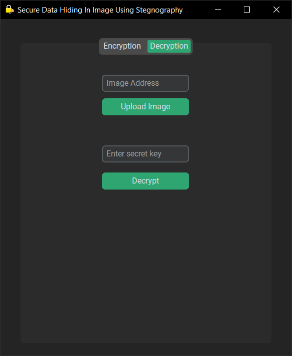

# Steganography Tool

🔐 This Python-based steganography tool allows users to securely hide and extract secret messages in images using AES encryption.

## 🚀 About the Project
This project combines cryptography and steganography to provide a secure way of hiding messages inside images. The hidden message is encrypted using AES (Advanced Encryption Standard) before being embedded into the image using the Least Significant Bit (LSB) technique. This ensures the message remains confidential and can only be retrieved with the correct decryption key.

## 🔧 How It Works
### 🔒 Encryption Process:
1. The user selects an image file.
2. The secret message is input along with an encryption key.
3. The encrypted message is converted into a binary format and embedded into the image using LSB modification.
4. The modified image is saved as a new file with the hidden message.

### 🔓 Decryption Process:
1. The user uploads the encoded image.
2. The program extracts the binary data from the image and reconstructs the encrypted message.
3. The extracted encrypted message is decrypted using the provided key.
4. The decrypted message is displayed to the user.

## ✨ Features
- **AES Encryption**: Ensures secure message encryption before embedding.
- **Image Steganography**: Uses the Least Significant Bit (LSB) technique to embed messages into images.
- **User-Friendly GUI**: Built with `customtkinter` for an intuitive interface.
- **Encryption & Decryption**:
  - Upload an image and embed a secret message with AES encryption.
  - Extract and decrypt hidden messages from encoded images.

## 📸 Demo Screenshots
### 🖥️ Encryption Process:


### 🔍 Decryption Process:


## 📥 Installation
### Prerequisites
Ensure you have Python 3 installed and the required libraries:
```sh
pip install customtkinter pillow pycryptodome
```

## ▶️ Usage
Run the main script:
```sh
python main.py
```

### 🔒 Encryption Process:
1. Select an image (PNG format recommended).
2. Enter a secret message.
3. Provide an encryption key.
4. Click "Encrypt" to embed the encrypted message into the image.
5. The output image (`*_encoded.png`) will contain the hidden message.

### 🔓 Decryption Process:
1. Upload an encoded image.
2. Enter the decryption key.
3. Click "Decrypt" to retrieve the hidden message.

## 📁 File Structure
```
📂 Steganography-Tool
 ┣ 📜 main.py         # Main application with GUI
 ┣ 📜 encrypt.py      # Encryption logic
 ┣ 📜 decrypt.py      # Decryption logic
 ┣ 📜 README.md       # Project documentation
 ┗ 📜 logo.ico        # Application icon file
```

## 🤝 Contributing
Contributions are welcome! You can fix this repository and submit a pull request.

## 📜 License
This project is licensed under the MIT License.

